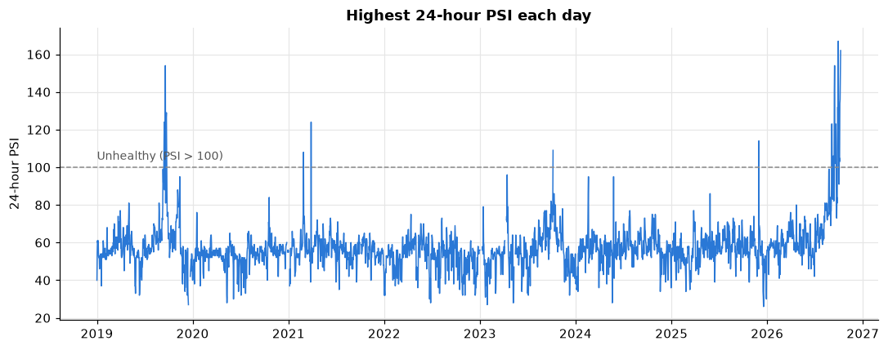

# Forecasting Regional PSI in Singapore

*Can we predict tomorrow's 24-hour PSI for Singapore's North, South, East, West and Central regions using today's air quality, fire hotspots in Sumatra and Borneo, and weather?*

**Author:** Tan Wan Yun · MSc Data Science for Sustainability, NUS

<!-- After running the notebook, put your headline chart here, e.g.: -->
<!--  -->

## Why this matters

Transboundary haze from peatland and forest fires periodically pushes Singapore's 24-hour PSI into the Unhealthy range (above 100). In 2026, a strong El Niño brought the first unhealthy haze since 2023. Hospitals, schools and outdoor workers depend on advance warning to protect vulnerable people. This project tests how well public data can predict next-day PSI values in each of Singapore's five regions.

## Key findings

<!-- Replace with regional forecast errors from section 5 of the notebook. -->
- The North-region model had a test-period MAE of **__ PSI points**, versus **__** for persistence.
- The lowest regional MAE was **__** in **__**; the highest was **__** in **__**.
- The latest forecast predicts PSI values of **__** (North), **__** (South), **__** (East), **__** (West) and **__** (Central).

## Data

| Source | What | Access |
|---|---|---|
| [data.gov.sg](https://data.gov.sg) (NEA) | Hourly 24-hour PSI and PM2.5 by region | Free API |
| [Open-Meteo](https://open-meteo.com) (ERA5 reanalysis) | Daily rain, wind direction/speed, temperature, humidity for Singapore | Free API, no key |
| [NASA FIRMS](https://firms.modaps.eosdis.nasa.gov) | VIIRS S-NPP satellite fire hotspots, Sumatra and Borneo | Free API key |

Study period: January 2019 to the present. This covers the 2019, 2023 and 2026 haze episodes. PSI is retained separately for all five Singapore regions.

## Method

1. **Daily table.** Each day gets its highest 24-hour PSI in North, South, East, West and Central, hotspot counts by region (3-day rolling, log-scaled), wind direction, rain and humidity.
2. **Target.** Each region's next-day highest 24-hour PSI is predicted as a numeric value.
3. **Time-based split.** Train on 2019–2022 and test on 2023 onwards. Days are never shuffled, so the model never sees the future.
4. **Models.** A gradient-boosting regressor is trained for each region; a persistence baseline predicts tomorrow will equal today's PSI.
5. **Evaluation.** Mean absolute error (MAE) and root mean squared error (RMSE) compare predictions with observations in PSI points.

## Limitations

- There are only a handful of haze episodes, so the results carry real uncertainty.
- Weather data is reanalysis for a single point. An operational system would use forecast weather.
- Hotspots are split into regions with an approximate boundary, and cloud cover can hide fires from satellites.

## Reproduce it

```bash
git clone https://github.com/<your-username>/haze-risk-singapore.git
cd haze-risk-singapore
pip install -r requirements.txt

cd src
python get_psi.py          # ~1-2 hours the first time (resumable)
python get_weather.py      # seconds
python get_hotspots.py     # needs FIRMS_MAP_KEY set; ~10-20 minutes
python build_dataset.py
cd ..
jupyter notebook notebooks/haze_analysis.ipynb
```

The PSI downloader reuses cached API responses but reprocesses them into the regional columns. Run `build_dataset.py` after downloading; the notebook saves the next-day regional predictions to `data/processed/regional_psi_forecast.csv`.

## Repository structure

```
src/           data download and feature scripts
notebooks/     analysis, charts and models
figures/       saved charts
data/          raw downloads (not committed) and processed tables
```
